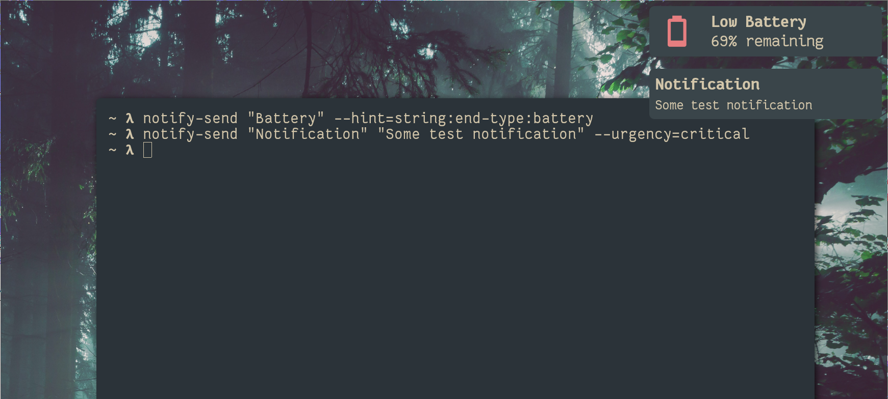

## Example Config

The following is an example config that implements a basic widget for general notifications, as well as a special "low battery" widget.



##### config.toml
```toml
[config]
eww-window = "notification-frame"
eww-default-notification-key = "end-notification"
max-notifications = 10
notification-orientation = "v"

timeout.urgency.low = 5 
timeout.urgency.normal = 10
timeout.urgency.critical = 0

[[notification-type]]
name = "battery-warning"
eww-key = "battery-widget" 
hint = "battery"
timeout = 0
```

##### eww.yuck
```yuck
(defvar end-notifications "")

(defwindow notification-frame
 :monitor 0
 :geometry (geometry 
     :x "0px"
     :y "0px"
     :width "480px"
     :height "0px"
     :anchor "top right")
 :stacking "fg"
 :windowtype "dialog"
 :wm-ignore true
 (literal :content end-notifications))

(defwidget end-notification 
 [end-id end-appname end-appicon end-summary end-body end-hints end-actions]
 (box 
  :class "end-default-notification-box"
  (literal :content 
    { end-body != "" 
      ? '
        (box
          :orientation "vertical"
          (label
            :class "notification-title notification-text"    
            :yalign 1
            :xalign 0 
            :text "${end-summary}")
          (label
            :class "notification-content notification-text"
            :yalign 1
            :xalign 0
            :text "${end-body}"))'
      : '
        (label
          :class "notification-title notification-text"    
          :yalign 1
          :xalign 0 
          :text "${end-summary}")'
    })))

(defwidget battery-widget
  [end-id end-appname end-appicon end-summary end-body end-hints end-actions]
  (eventbox
    :onclick { matches(end-actions, "key: \"default\"") ? "/usr/local/bin/end action ${end-id} default" : "/usr/local/bin/end close ${end-id}" }
    (box
      :class "end-default-notification-box"
      :orientation "horizontal"
      :space-evenly false
      (label
        :class "notification-text battery-icon"
        :yalign 0.5
        :xalign 0.5
        :text "󰁺"
      )
      (box
        :orientation "vertical"
        :hexpand true
        (label 
          :class "notification-text notification-title"
          :hexpand true
          :yalign 0.5
          :xalign 0
          :text "Low Battery")
        (label
          :class "notification-text"
          :vexpand true
          :hexpand true
          :yalign 0.5
          :xalign 0
          :text "${EWW_BATTERY["BAT0"]["capacity"]}% remaining")))))
```

##### eww.scss
```scss
.end-default-notification-box {
  background-color: #3a454a; 
  padding: 12px;
  margin: 12px;
  border-radius: 10px;
}

.notification-text {
  color: #d3c6aa; 
  font-family: 'Your Favorite Font'
}

.notification-title {
  font-weight: bold;
  font-size: 1em;
}

.notification-content {
  font-size: .8em;
}
```
