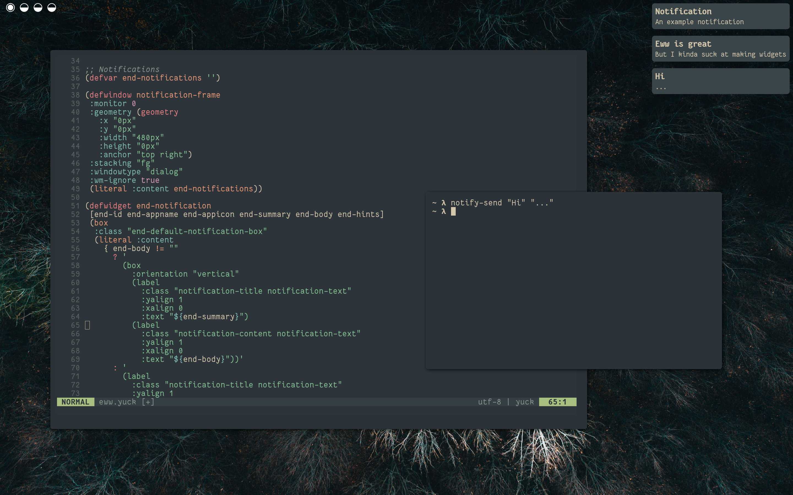

# Eww Notification Daemon

There are a few great notification daemons around. Unfortunately, they all use their own configuration language. 
If you already use [eww](https://github.com/elkowar/eww) for your widgets, wouldn't it be great if you could just use it for your notifications as well?

## Features
The Eww Notification Daemon, or End for short, allows you to do exactly that. It leverages eww's `literal` widget to dynamically display 
libnotify notifications. You define the eww widgets that are used to display a notification and the eww window that they will appear in. You can 
define multiple widgets for your notifications and select between them via libnotify hints. 



## Getting Started
You can either build the project yourself or use one of the prebuilt binaries under Releases. 

#### Building from Source
This project is written in Haskell. You can use [GHCup](https://www.haskell.org/ghcup/) to install the required tools.
To build End, run the following commands.

```bash
git clone https://github.com/lucalabs-de/end
cd end
cabal build
```
You will find the executable under 
```
dist-newstyle/build/x86_64-linux/ghc-<GHC version>/EwwNotificationDaemon-<End version>/x/end/build/end
```
To start the notification daemon, simply run the executable. You'll probably want to put something like
```bash
end &
```
in your WM's init file. 

## Usage

#### Eww Configuration
You need to provide an eww window that End will use to show notifications. For this to work, the window is required 
to contain the widget `(literal :content end-notifications)`, where `end-notifications` is an eww variable that needs to be defined using `(defvar end-notifications "")`.

#### Commands
The following commands are supported.

```bash
end
```
Starts the notification daemon.

```bash
end stop
```
Stops the notification daemon.

```bash
end close <id>
```
Closes the notification with the given ID. Useful for notifications that don't time out.

## Configuration
End checks `$XDG_CONFIG_HOME/end` (most likely `~/.config`) for a `config.toml`, which is structured as follows.

```toml
[config]
### Optional. Name of the widget used for general notifications. If this is not supplied, End 
### will fall back to a default widget (which is really ugly, so you'll want to set this ^^).
eww-default-notification-key = ""

### Optional. Name of the eww window that the notifications are rendered in. If this is set,
### End will manage the window for you. If not, you will have to open/close it yourself. 
eww-window = ""

### Optional. The maximal number of notifications that are shown at a time. When the current number
### of visible notifications exceeds this value, the notification with the soonest timeout will be 
### dropped. If none of the notifications have a timeout, the oldest will be dropped.
###
### A value of 0 means that notifications will never get dropped.
max-notifications = 0

### Optional. Defines whether multiple notifications should be displayed above each other (v) or
### next to each other (h).
notification-orientation = "v"

### Optional. Defines the timeouts for different types of notifications in seconds. A value 
### of 0 means that the notification will never timeout
timeout.urgency.low = 5
timeout.urgency.normal = 10
timeout.urgency.critical = 0

### Optional. This allows you to define custom notification types for special purposes.
### You can define as many as you want.
[[notification-type]]
### Required. The name of the notification. 
name = "battery-warning"

### Required. The name of the eww widget that should be used to display this type of notification.
eww-key = "battery_widget" 

### Required. The hint value for the key "end-type" that triggers this type of notification.
### This example notification could, for instance, be triggered by running 
### "notify-send --hint=string:end-type:battery 'battery low'".
hint = "battery"

### Required. Specifies a custom timeout that overrides the urgency-based value. Again, a value of 0
### means that the notification will not time out.
timeout = 0

```
#### Custom Notification Widgets
We've seen that you can define your own notification widgets. 
The notification data is supplied to the widget via the parameters `end-id` `end-appname` `end-appicon` `end-summary` `end-body` and `end-hints`.
As such, a general notification widget looks as follows.

```yuck
(defwidget end-notification 
 [end-id end-appname end-appicon end-summary end-body end-hints]
 ... your content ...)
```

The parameters correspond to the libnotify [notification components](https://specifications.freedesktop.org/notification-spec/notification-spec-latest.html#basic-design).

**Remark:**
In the future, I plan to parse the libnotify standard hints (like `image-path`, `category`, etc.) internally and expose the corresponding values
individually as eww widget parameters. Until then you will need to parse them from the `end-hints` parameter manually using eww's expressions.

#### Example Configuration 
You can find a basic complete example configuration in [EXAMPLE.md](EXAMPLE.md)

