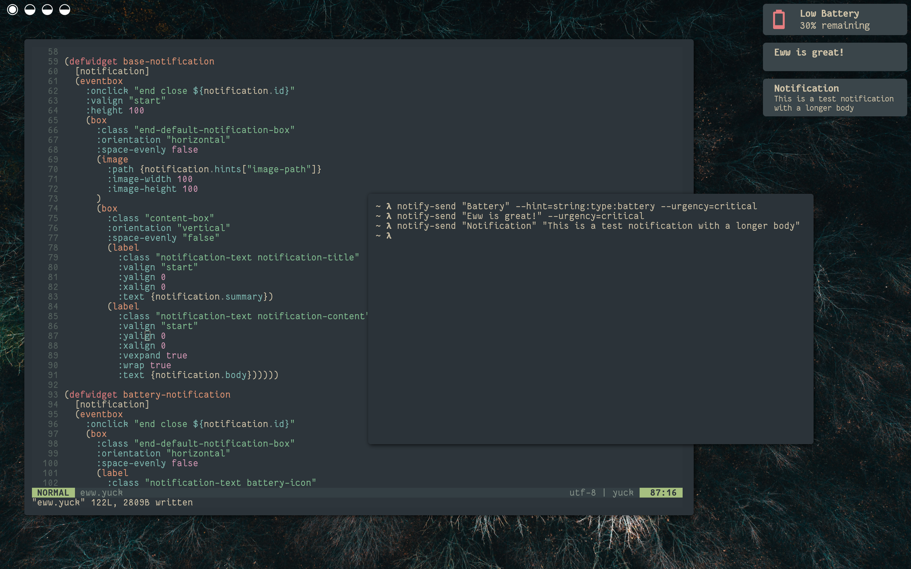

# Eww Notification Daemon

There are a few great notification daemons around. Unfortunately, they all use their own configuration language. 
If you already use [eww](https://github.com/elkowar/eww) for your widgets, wouldn't it be great if you could just use it for your notifications as well?

## Features
The Eww Notification Daemon, or End for short, allows you to do exactly that. It leverages eww's `literal` widget to dynamically display 
libnotify notifications. You define the eww widgets that are used to display a notification and the eww window that they will appear in. 



## Getting Started
You can either build the project yourself or use one of the prebuilt binaries under Releases.

### Building from Source

#### Using Stack
I recommend using Stack to avoid dependency problems. To install Stack, just run

```bash
curl -sSL https://get.haskellstack.org/ | sh
```
or check out [docs.haskellstack.org](https://docs.haskellstack.org/en/stable/install_and_upgrade/#manual-download) if you don't like `curl | sh`. 
Then run the following commands to build End. 

```bash
git clone https://github.com/lucalabs-de/end
cd end
stack install
```

This will install the executable under `~/.local/bin`.

#### Using Cabal
You can also use Cabal. The required tools can be installed by [GHCup](https://www.haskell.org/ghcup/).
To build End, run the following commands.

```bash
git clone https://github.com/lucalabs-de/end
cd end
cabal build
```
You will find the executable under 
```
dist-newstyle/build/x86_64-linux/ghc-<GHC version>/EwwNotificationDaemon-<End version>/x/end/build/end
```

## Usage
To start the notification daemon, simply run the executable. You'll probably want to put something like
```bash
end &
```
in your WM's init file. 

#### Eww Configuration
You need to provide an eww window that End will use to show notifications. For this to work, the window is required 
to contain the widget `(literal :content end-notifications)`, where `end-notifications` is an eww variable that needs to be defined using `(defvar end-notifications "")`.

#### Commands
The following commands are supported.

```bash
end
```
Starts the notification daemon.

```bash
end stop
```
Stops the notification daemon.

```bash
end close <id>
```
Closes the notification with the given ID. Useful for notifications that don't time out.

```bash
end action <id> <key>
```
Invoke the action with identifier `<key>` for the notification with the given ID.

## Configuration
End checks `$XDG_CONFIG_HOME/end` (most likely `~/.config/end`) for a `config.toml`, which is structured as follows.

```toml
[config]
### Optional. Name of the widget used for general notifications. If this is not supplied, End 
### will fall back to a default widget (which is really ugly, so you'll want to set this ^^).
eww-default-notification-key = ""

### Optional. Name of the eww window that the notifications are rendered in. If this is set,
### End will manage the window for you. If not, you will have to open/close it yourself. 
eww-window = ""

### Optional. The maximal number of notifications that are shown at a time. When the current number
### of visible notifications exceeds this value, the notification with the soonest timeout will be 
### dropped. If none of the notifications have a timeout, the oldest will be dropped.
###
### A value of 0 means that notifications will never get dropped.
max-notifications = 0

### Optional. Defines whether multiple notifications should be displayed above each other (v) or
### next to each other (h).
notification-orientation = "v"

### Optional. Defines the timeouts for different types of notifications in seconds. A value 
### of 0 means that the notification will never timeout
timeout.urgency.low = 5
timeout.urgency.normal = 10
timeout.urgency.critical = 0
```

#### Custom Notification Widgets
We've seen that you can define your own notification widgets. 
The notification data is supplied to the widget by the parameter `notification`, which is a JSON object of the following form

```
{
    id: <notification id>
    application: <Application Name>
    icon: <Notification Icon> 
    summary: <Summary>
    body: <Body>
    hints: {
        "<hint key>": <hint value>,
        ...
    },
    actions: [
        {
            key: <action identifier>
            name: <action string>
        }
    ]
}
```

As such, a general notification widget looks as follows.

```yuck
(defwidget end-notification 
 [notification]
 ... your content ...)
```

The parameters correspond to the libnotify [notification components](https://specifications.freedesktop.org/notification-spec/notification-spec-latest.html#basic-design).

##### Images
The Notification Specification defines two different ways of attaching images to notifications. Applications may either supply a file path (using the `image-path` hint) to an image or the binary image data itself (using the `image-data` hint). Since eww does not have any way of parsing binary data, end converts the image for you and exposes a file path to the resulting image. The hints will thus never contain the `image-data` key, and if the notification contains an image the `image-path` hint will be set.


#### Example Configuration 
You can find a basic complete example configuration in the example folder.

